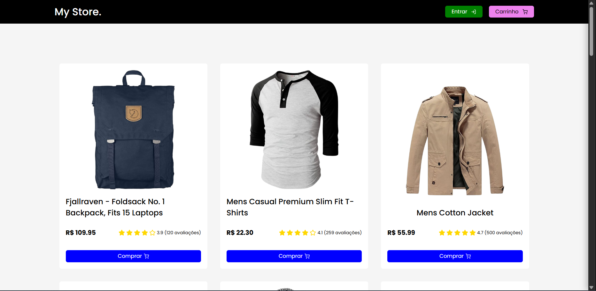
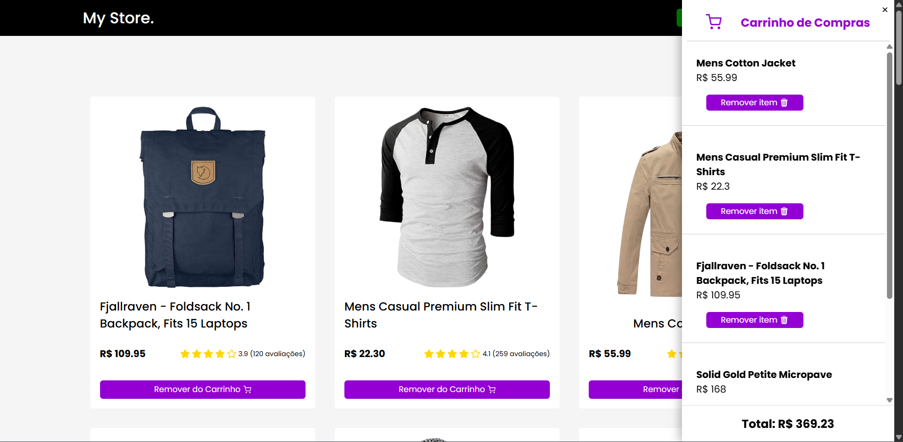
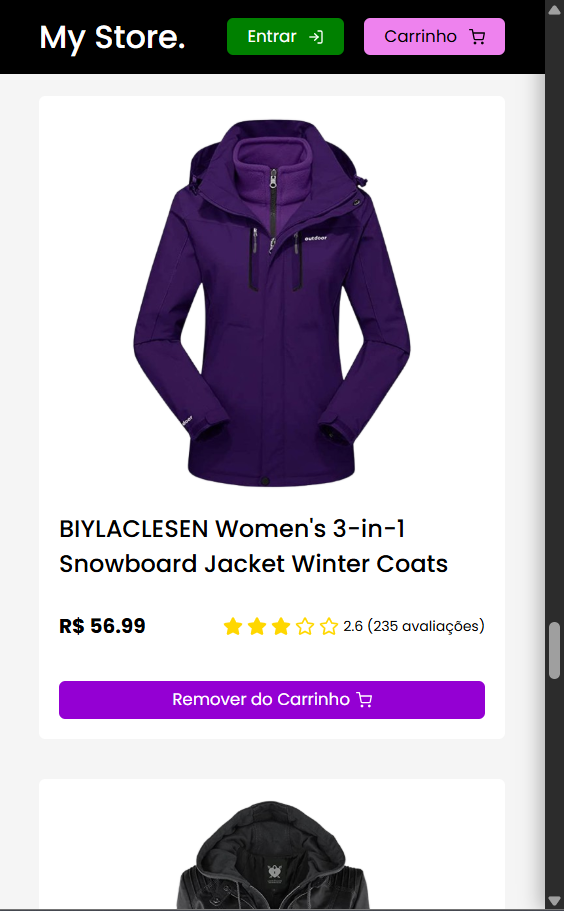

# My Store

Projeto pessoal para estudo de **React**, com foco em aprender e praticar os **conceitos básicos da biblioteca** por meio do desenvolvimento de uma **Página de produtos** de um e-commerce Consumindo a API [Fake Store API](https://fakestoreapi.com/)

---

## ✨ Funcionalidades

- Listagem de produtos
- Consumo de API externa
- Carrinho de compras
- Adicionar e remover itens do carrinho
- Exibição de imagem, preço, descrição e avaliação dos itens em cards responsivos
 ---

## 🎯 Objetivo do Projeto

* Implementar Styled Components
* Gerenciamento de estados com Redux

---

## 🚀 Tecnologias Utilizadas

* React
* Redux
* React Scripts
* Styled Components
* TypeScript 5
* yarn v1
* Node.js
---

## 📌 Status do Projeto

🚧 **Em desenvolvimento / estudo**

Projeto desenvolvido para fins de estudo e prática de React.

---

## 📂 Como executar o projeto

```bash
# instalar dependências
yarn install

# rodar o projeto
yarn start
```

###

| | | |
|---|---|---|
|  |  | |
